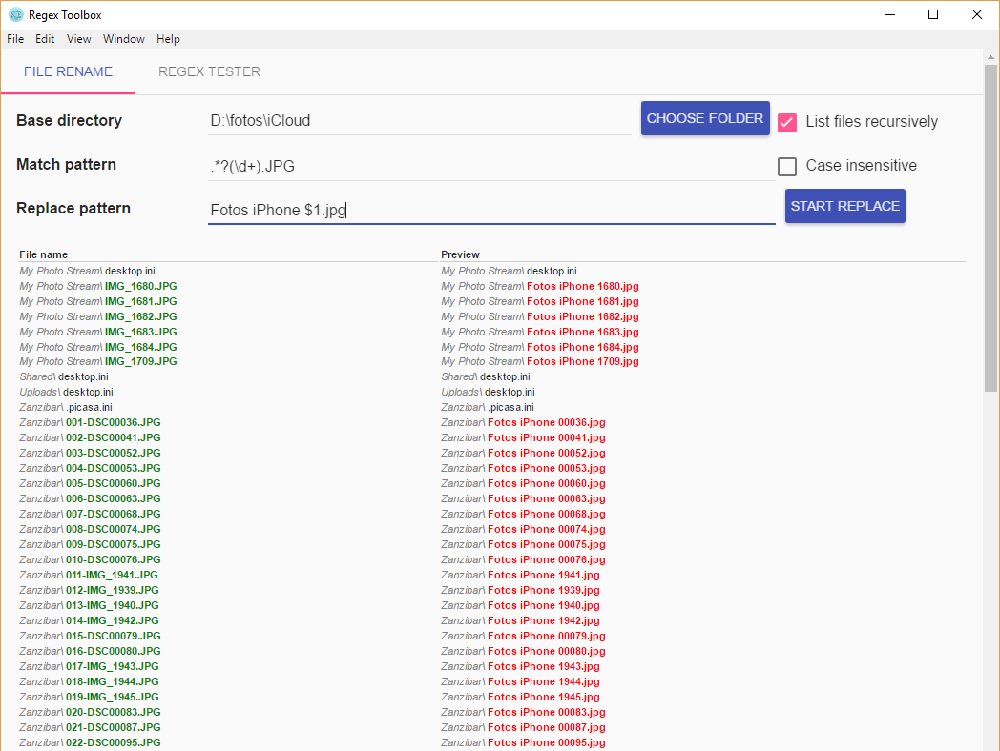

# regex-toolbox

[](https://codeclimate.com/github/guggero/regex-toolbox)

## What does it do?

I started this project because I needed something like the awesome little tool [RegexRenamer](http://regexrenamer.sourceforge.net/)
but with the ability to rename files recursively in many folders.

So at the moment it just does just that, recursively rename files with a Regular Expression, including a live preview.



But in the end Regex based renaming will just be one of many features. 

The following features will be implemented soon:
* Regex tester: Test your regular expression against a test string
* Regex search/replace: Find and replace text in files recursively
* whatever features you guys think should be implemented

## Why electron?

I wanted to build a multi platform desktop application. Why desktop application you ask? Because local file system, duh! :)  
So as a Java developer I could have built a Java GUI with Swing or SWT... Nope, been there, done that, never again if I don't have to!  
I always liked web GUIs better. So when I heard about electron (nodejs + Chrome) I knew that was the platform to go for.

I'm well aware that a 50MB download for a simple renaming tool is absolute overkill ;-)

## To Use

To clone and run this repository you'll need [Git](https://git-scm.com) and [Node.js](https://nodejs.org/en/download/) (which comes with [npm](http://npmjs.com)) installed on your computer. From your command line:

```bash
# Clone this repository
git clone https://github.com/guggero/regex-toolbox
# Go into the repository
cd regex-toolbox
# Install dependencies and run the app
npm install && npm start
```

Learn more about Electron and its API in the [documentation](http://electron.atom.io/docs/latest).

#### License [Apache 2.0](LICENSE)
